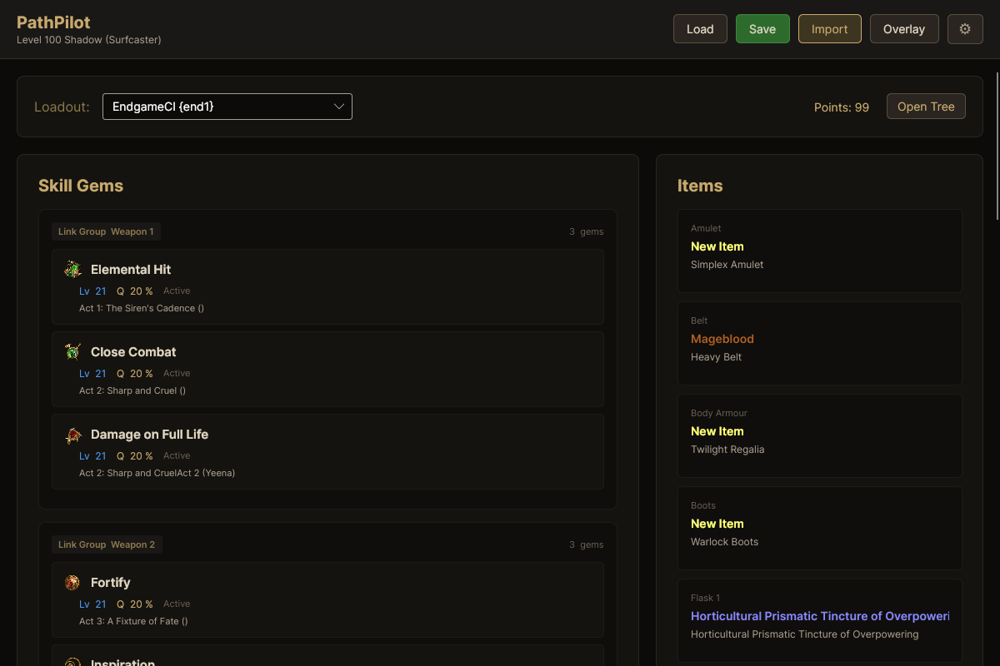
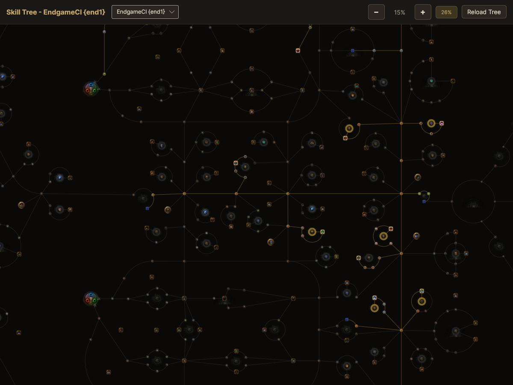
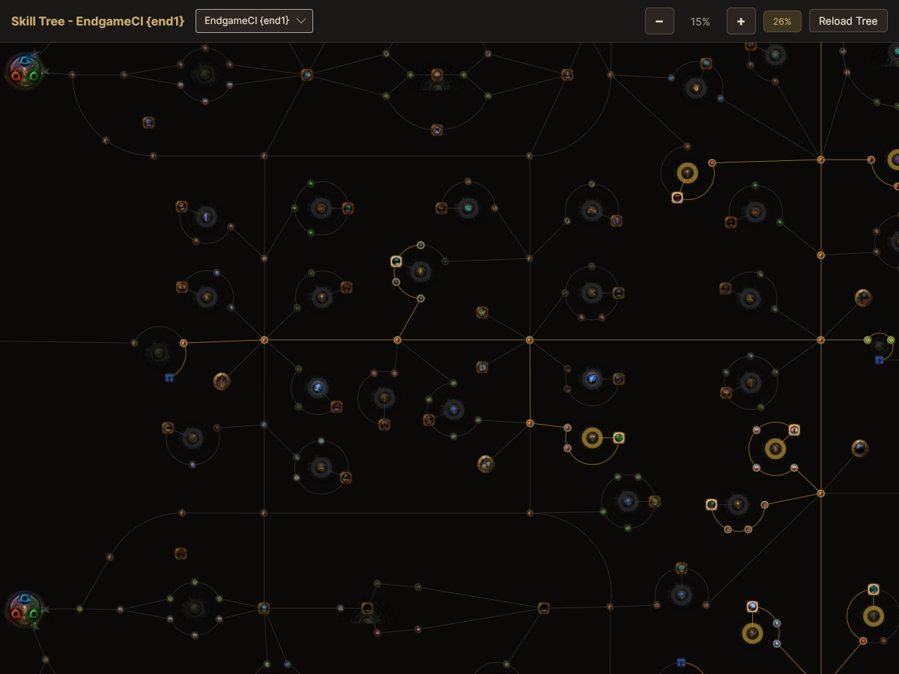
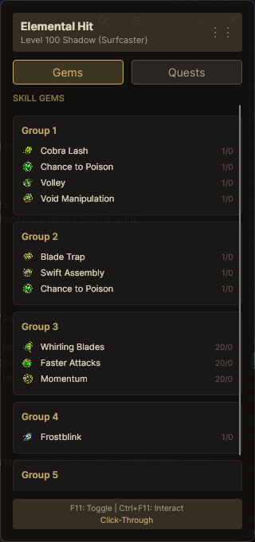
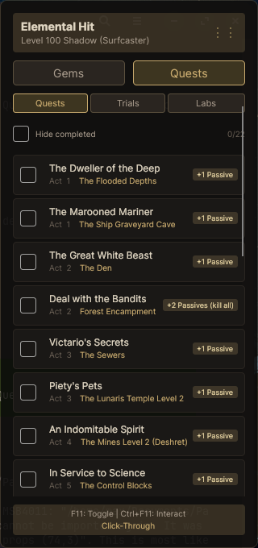
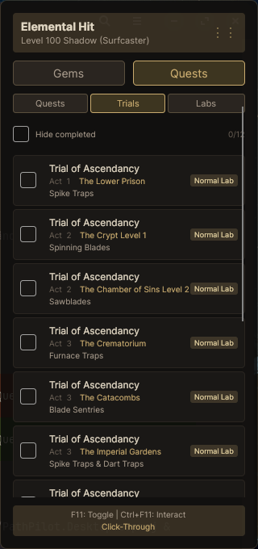
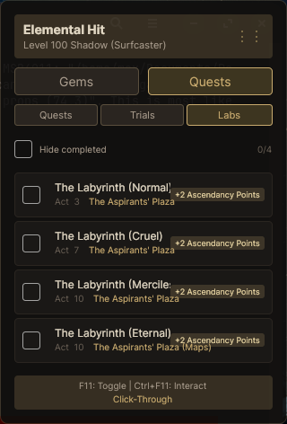

# PathPilot

A Path of Exile build guide desktop application that helps players develop their characters according to a Path of Building build.

Built with .NET 10 and Avalonia UI.

## Features

- **Build Import**: Import Path of Building codes or pobb.in URLs
- **Save/Load**: Save and load builds locally, auto-loads last build on startup
- **Unified Loadout Selector**: Switch SkillSet, ItemSet, and TreeSet together
- **Gem Display**: Skill gems with real PoE Wiki icons (24x24), levels, quality, colors, and acquisition info (quest/vendor)
- **Item Display**: Items with rarity colors, mod highlighting, and tooltips with full details
- **Skill Tree Viewer**: Native SkiaSharp rendering with zoom, pan, hover tooltips, and class start node sprites
- **Ingame Overlay**: Transparent overlay showing gems and quest tracker over the game (Windows)
- **Quest Tracker**: Track skill point quests, ascendancy trials (with trap types), and labs with progress saving
- **PoE Dark Theme**: Path of Exile-inspired UI with warm dark tones, gold/bronze accents, and medieval-fantasy aesthetic

## Overlay

The overlay shows your gems and quest progress while playing:

- **Hotkeys** (configurable):
  - `F11` - Toggle overlay visibility
  - `Ctrl+F11` - Toggle between click-through and interactive mode
- **Click-Through**: Clicks pass through the overlay to the game
- **Draggable**: Drag via header in interactive mode
- **Position saved**: Always opens at the last position
- **Tabs**: Switch between Gems and Quests view
- **Quest categories**: Quests, Trials, Labs with progress counters

> **Note**: The overlay only works with "Windowed Fullscreen" in PoE (standard for all PoE overlays).

## Installation

```bash
# Clone the repository
git clone https://github.com/Maex-z9/PathPilot.git
cd PathPilot

# Run the project
dotnet run --project src/PathPilot.Desktop/PathPilot.Desktop.csproj
```

## System Requirements

- .NET 10 SDK
- Windows (for overlay hotkeys), Linux (limited functionality)

## Screenshots

### Main Window — Gems & Items


### Skill Tree Viewer




### Ingame Overlay








## License

MIT
